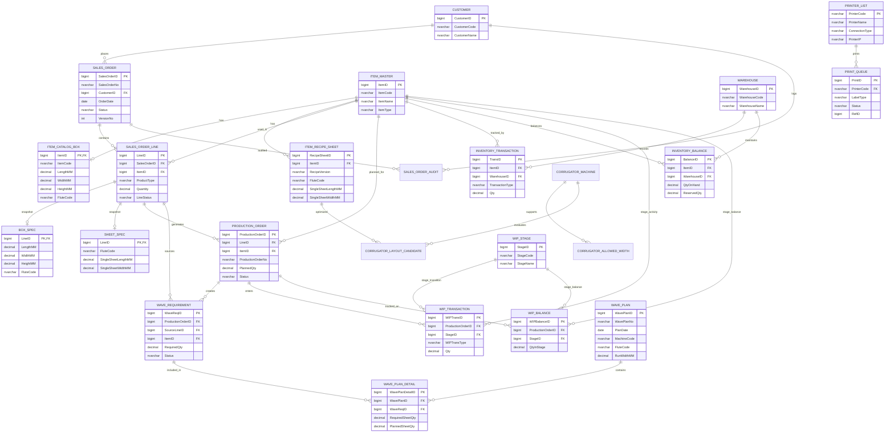

# DGP ERP Carton ERD

This document describes the relational model for the DGP ERP Carton database and the key relationships between core business entities.

## 1. Core entities

The design centers on these business domains:

- Customer management
- Item catalog and recipe management
- Sales orders and order revisions
- Production planning and wave requirements
- Inventory and WIP tracking
- Printer and print queue operations

## 2. ER diagram

## 3. Relationship notes

- A Customer can have many SalesOrder records.
- Each SalesOrder can have many SalesOrderLine records.
- Each SalesOrderLine stores a snapshot of box or sheet technical details in BoxSpec or SheetSpec.
- A ProductionOrder is generated from a sales order line and can create one or more WaveRequirement records.
- A WavePlan groups compatible WaveRequirement records for a machine and flute width.
- Inventory transactions are the source of inventory balance updates, and WIP transactions track stage level movement.
- PrintQueue records represent asynchronous print jobs sent to a configured printer.

## 4. Key constraints summary

The database uses the following types of integrity rules:

- Primary keys for each entity
- Foreign keys for all dependent relationships
- Unique constraints for business identifiers
- Status check constraints for workflow states
- Value and quantity validation constraints for item and order data

## 5. Database conventions

- Use Azure SQL compatible T-SQL.
- Use IDs as BIGINT identity keys for transaction scale.
- Keep audit records on every sales order lifecycle change.
- Do not allow direct inventory updates without transaction-based flow.
- Separate operational inventory from WIP stage movement.
- Use print queue processing for all printer jobs.

## 6. Next step

This ERD is the schema foundation for the database layer. The next phase is to add stored procedures and application logic on top of this structure.
